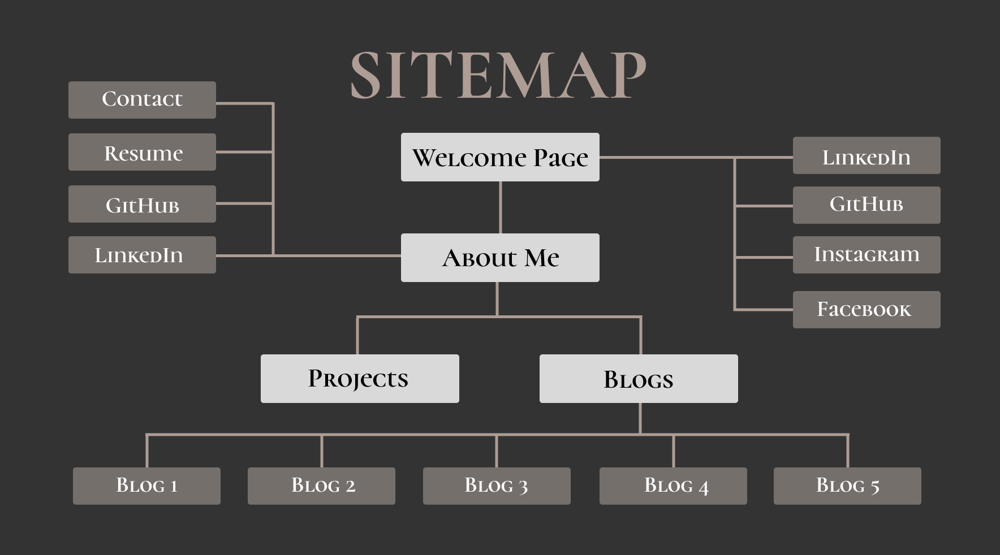
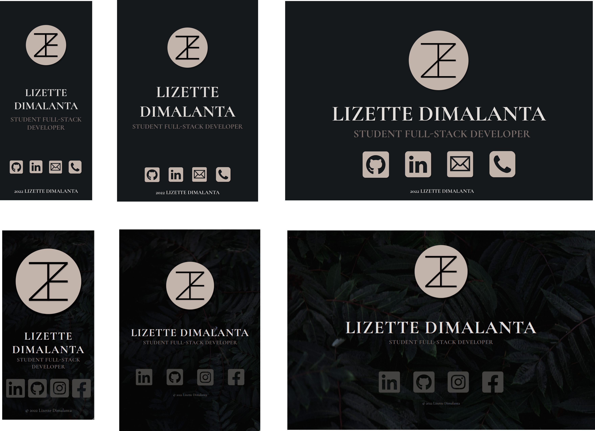

# **T1A2**: Portfolio Documentation

## Portfolio Website

## [text](link)

## GitHub Repo

## [LizetteDimalanta_T1A2](https://github.com/Lizette-Dimalanta/LizetteDimalanta_T1A2)

-----

## **Purpose, Goals & Target Audience**

-----
This portfolio website is both an exhibition and demonstration of my technical knowledge and capabilities, creativity and personality. Built as a foundation to display my future projects, I intend to showcase my abilities to potential future employers in the tech sector, as a student full-stack developer.

-----

## **Functionality & Features**

-----
The website is built upon semantic elements, pseudo-elements and responsive design features in order to allow easy readibility of the website and allow flexibility and accessibility on various mobile, tablet and desktop platforms. I have chosen to design the site with a collection of neutral tones and elegant font styles, with the use of vibrant images to add contrast to the page.

Containing 4 main pages, the site allows for easy navigation using the top navbar, allowing access to the welcome page (through the logo), about me, projects and blogs. The features and functionalities of these pages are as followed:

## Home

The homepage is designed with the intention of attracting the target audience with the first interaction with the site. This contains hyperlinks in image form, and an added pseudo-class to the large logo button that allows the user to enter the site.

## About Me

This section acts as a main page, introducing primary information in relation to my personality/interests, professional background and contact details and links. The use of semantic elements and media queries are the primary components of this section (including flexbox, keyframes and a nav bar).

## Projects

Though still under development, this is created as the foundation for my future student and personal projects, that will be updated as I continue to develop my skills in technical learning and coding. Flexbox and keyframe animations are widely used, and all `:hover` pseudo-elements will be updated with a hyperlink when future projects are added.

## Blogs

The blogs page is my favourite part, as I have been able to further express my interests through the different topics in the five articles. As above, this page uses a similar layout and theme to the project page, customising each hyperlink with two images that alter using the `:hover` pseudo-element. Headers and footers are separated with the use of thematic breaks that also acts as an additional aesthetic to the page.

## Blog Pages

The following is a subsection of the blogs page, in which features the selected article and its associated information (such as topic, date, and length). Thematic breaks are used to separate the main content, suggested blogs, as well as headers and footers.

-----

## **Sitemap**

-----

-----

## **Screenshots**

-----

## Welcome

## About Me

## Projects

## Blogs

## Blog Post

-----

## **Tech Stack**

-----

**Browsers:** Firefox, Chrome
**Programming Languages:** HTML & CSS
**Sitemap/Wireframes:** Figma
**Repository:** GitHub
**Deployment & Hosting:** GitHub Pages
